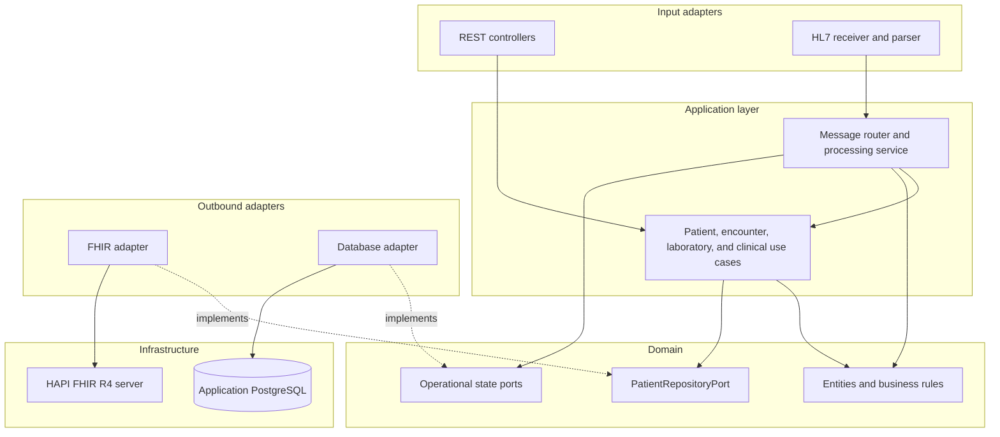

# Component diagram

Inside the application, the code follows the simplified hexagonal layout from init.md section 3. The layers below are logical. Plan 01 phase 2 puts them into the Maven modules, and the ArchUnit tests in phase 2.3 enforce the dependency direction, so the diagram and the build describe the same shape.

## Layering

## Layer responsibilities

| Layer | Responsibility |
|---|---|
| Input adapters | Accept REST calls and HL7 messages and convert transport payloads into calls on the application layer. Controllers and receivers hold no business decisions. |
| Application layer | Use cases and orchestration: patient, encounter, laboratory, and clinical workflows, plus message dispatch and processing state. |
| Domain | Entities, identifiers, and business rules. The domain has no Spring, jakarta, or ca.uhn imports, so it stays independent of transport formats and frameworks. |
| Ports | The interfaces the domain needs from outside, starting with `PatientRepositoryPort.findByIdentifier` and `save`, plus ports for operational message and audit state. |
| Outbound adapters | Implementations of the ports. The FHIR adapter uses the HAPI FHIR client, and the database adapter stores operational metadata in the application PostgreSQL. |
| Infrastructure | The application PostgreSQL and the HAPI FHIR R4 server with its own PostgreSQL. |

## Module mapping

| Maven module | Role | Dependency rule |
|---|---|---|
| healthcare-domain | Domain and ports | Depends on nothing outside the JDK |
| healthcare-hl7 | Inbound HL7 adapter: parser, receiver, router, acknowledgments | Depends on healthcare-domain only |
| healthcare-fhir | Outbound FHIR adapter: client, mappers, transactions, terminology | Depends on healthcare-domain only |
| healthcare-application | Spring Boot host: REST adapters, use cases, message dispatch, operational persistence | May depend on the domain, healthcare-hl7, and healthcare-fhir |
| healthcare-integration-tests | Cross-module and end-to-end tests | Depends on healthcare-application |

`healthcare-hl7` and `healthcare-fhir` never depend on each other, and no package cycles are allowed. The module direction test in plan 01 phase 2.3 checks the edges, and the domain purity test in the same phase checks that the domain module stays free of Spring, jakarta, and ca.uhn.

## Boundary rules

- Business rules stay independent of transport formats. Admission logic belongs to the encounter use case, not to an HL7 parser or a FHIR mapper ([ADR-0002](architecture-decisions/ADR-0002.md)).
- Mappers translate representations and hold no business decisions, per init.md section 2.
- Adapters depend inward on the domain and its ports. The domain depends on nothing outward, and the diagram preserves that direction.
