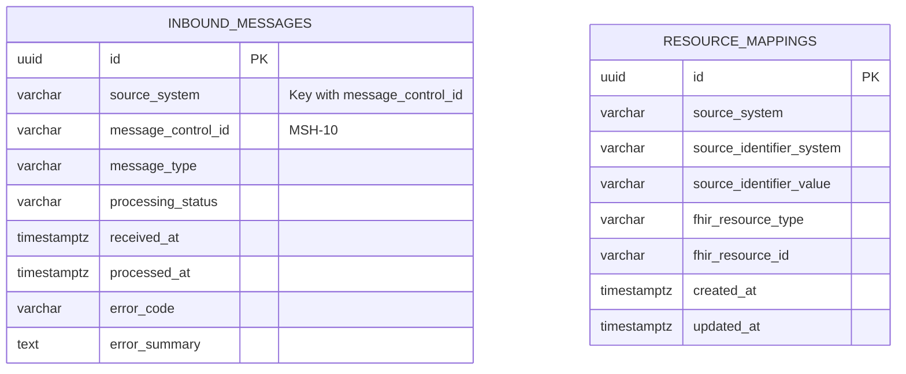

# Database design

The platform uses two logically separate PostgreSQL databases with one owner each. The split follows init.md section 5, and the reasoning is in [ADR-0004](architecture-decisions/ADR-0004.md). This page documents the ownership table, the application tables created by the plan 01 phase 5 migrations, and the rules that keep the two stores apart.

## Ownership

| Database | Stores | Does not store |
|---|---|---|
| Application PostgreSQL | Message control ids, processing status, retries, mappings, audit metadata | A duplicate of the full clinical record |
| FHIR PostgreSQL | Patient, Encounter, Observation, Condition, DiagnosticReport, and other FHIR resources | The HL7 processing queue and application workflow state |

The HAPI FHIR server is the only writer of the FHIR database ([ADR-0003](architecture-decisions/ADR-0003.md)). The application connects to it through the FHIR REST API and never with JDBC. HAPI FHIR internal tables are never modified directly. The table layout of the FHIR database belongs to the pinned server version, and schema upgrades come from the server image, not from application migrations.

## Application tables

Flyway migrations in `healthcare-application/src/main/resources/db/migration` create exactly these two tables, matching plan 01 phase 5.

### inbound_messages

Durable record of every received message and its processing state. The row is also the duplicate detection key.

| Column | Type | Null | Notes |
|---|---|---|---|
| id | UUID | no | Primary key |
| source_system | VARCHAR(100) | no | Sending system, for example the MSH sending application |
| message_control_id | VARCHAR(150) | no | MSH-10 |
| message_type | VARCHAR(50) | no | For example ADT^A01 |
| processing_status | VARCHAR(30) | no | One of RECEIVED, VALIDATED, PROCESSING, RETRY_PENDING, COMPLETED, QUARANTINED |
| received_at | TIMESTAMPTZ | no | Set when the message is accepted |
| processed_at | TIMESTAMPTZ | yes | Set when processing reaches a terminal state |
| error_code | VARCHAR(100) | yes | Stable error code for failures and quarantine |
| error_summary | TEXT | yes | Human readable summary, free of protected health information |

Constraints and indexes:

- `uq_source_message` unique on `(source_system, message_control_id)`. The retransmission rule depends on it.
- `ix_inbound_messages_status_received` on `(processing_status, received_at)` supports picking up due work in order.

### resource_mappings

Ties a source system identifier to the FHIR resource it produced. This mapping is how the application finds the FHIR resource id again without treating the source identifier as the resource id.

| Column | Type | Null | Notes |
|---|---|---|---|
| id | UUID | no | Primary key |
| source_system | VARCHAR(100) | no | Same values as in `inbound_messages` |
| source_identifier_system | VARCHAR(255) | no | For example the MRN assigning authority |
| source_identifier_value | VARCHAR(255) | no | For example MRN-1001 |
| fhir_resource_type | VARCHAR(100) | no | For example Patient or Encounter |
| fhir_resource_id | VARCHAR(150) | no | Assigned by the FHIR server |
| created_at | TIMESTAMPTZ | no | `NOT NULL DEFAULT now()`, set at insert time |
| updated_at | TIMESTAMPTZ | no | `NOT NULL DEFAULT now()`, refreshed when the mapping changes |

Constraints and indexes:

- `uq_source_resource` unique on `(source_system, source_identifier_system, source_identifier_value, fhir_resource_type)`.
- `ix_resource_mappings_fhir` on `(fhir_resource_type, fhir_resource_id)`.

### ER diagram

There is no foreign key between the two tables. `inbound_messages` tracks ingestion, `resource_mappings` tracks identity, and `source_system` is the shared correlation value. Plan 04 extends the schema with retry bookkeeping such as attempt count and next attempt time through new migrations; this page documents the phase 5 baseline.

## Migration rules

- Flyway owns the application schema. Migrations live in `healthcare-application` only, under the default location `classpath:db/migration`.
- `healthcare-fhir` has no Flyway dependency and cannot run migrations against the FHIR database.
- No module points application JDBC or Flyway at the FHIR database. The FHIR database is not exposed on a host port and is reachable only from the HAPI FHIR server container.
- Migrations are additive. A change to an existing column ships as a new migration, never as an edit to an applied file.

## Consistency rules

- No distributed transaction spans the two databases. A FHIR transaction is atomic inside the FHIR server, and the application database writes are separate. The design accepts this and recovers with idempotency instead of two-phase commit, per init.md sections 4 and 5.
- `uq_source_message` prevents repeated work for a retransmitted message, and `resource_mappings` plus an identifier search make FHIR writes repeatable.
- The processing status column drives the state machine described in [ADR-0005](architecture-decisions/ADR-0005.md): RECEIVED, VALIDATED, PROCESSING, RETRY_PENDING, COMPLETED, QUARANTINED.
- Timestamps are `TIMESTAMPTZ` and stored in UTC.
- Rows never hold patient names, diagnoses, raw HL7 payloads, or other protected health information; error summaries carry codes and operational detail only.
