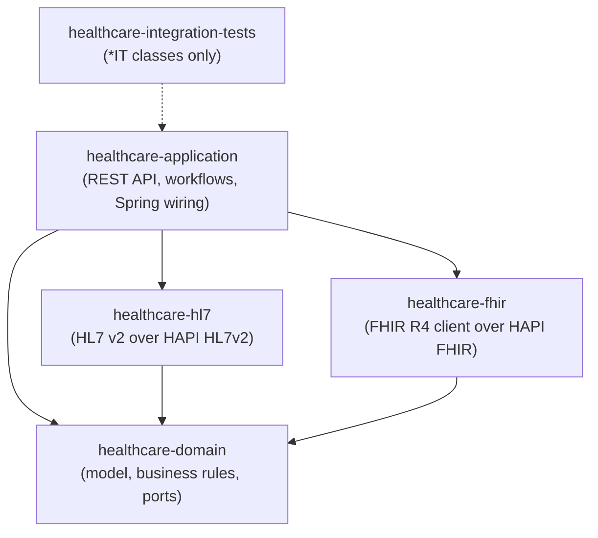

# Module dependencies

The five Maven modules depend on each other in one direction only. Two
ArchUnit test classes enforce the direction: the domain check runs under
Surefire, the module check runs under Failsafe.

## Module graph



`healthcare-integration-tests` has no production classes. It depends on
`healthcare-application` so its test classpath contains the other four
modules.

## Rules enforced by the build

`healthcare-domain/src/test/java/com/example/healthcare/domain/DomainArchitectureTest.java`
(Surefire):

- Classes in `com.example.healthcare.domain..` depend only on
  `com.example.healthcare.domain..` and `java..` (the JDK).
- No class in `com.example.healthcare.domain..` depends on
  `org.springframework..`.
- No class in `com.example.healthcare.domain..` depends on `jakarta..`.
- No class in `com.example.healthcare.domain..` depends on `ca.uhn..`.

`healthcare-integration-tests/src/test/java/com/example/healthcare/architecture/ModuleDependencyIT.java`
(Failsafe):

- No class in `com.example.healthcare.domain..` depends on
  `com.example.healthcare.hl7..`, `com.example.healthcare.fhir..`, or
  `com.example.healthcare.application..`.
- No class in `com.example.healthcare.hl7..` depends on
  `com.example.healthcare.fhir..` or `com.example.healthcare.application..`.
- No class in `com.example.healthcare.fhir..` depends on
  `com.example.healthcare.hl7..` or `com.example.healthcare.application..`.
- Slices matching `com.example.healthcare.(*)..` are free of cycles.

`healthcare-application` is allowed to depend on the domain, HL7, and FHIR
modules. No rule restricts it; the rules above pin the other four modules.

Both test classes ignore test classpaths (`DoNotIncludeTests`), so test code
can use any framework. Each rule allows an empty class set, which keeps the
skeleton green before domain classes land. The rules start constraining code
as soon as the first class appears.

## Running the checks

```bash
./mvnw -pl healthcare-domain test
./mvnw -pl healthcare-integration-tests -am verify -Dit.test=ModuleDependencyIT
```
