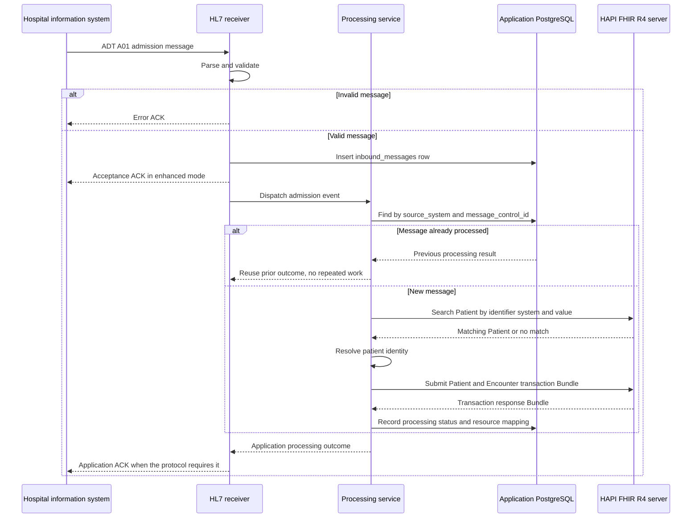
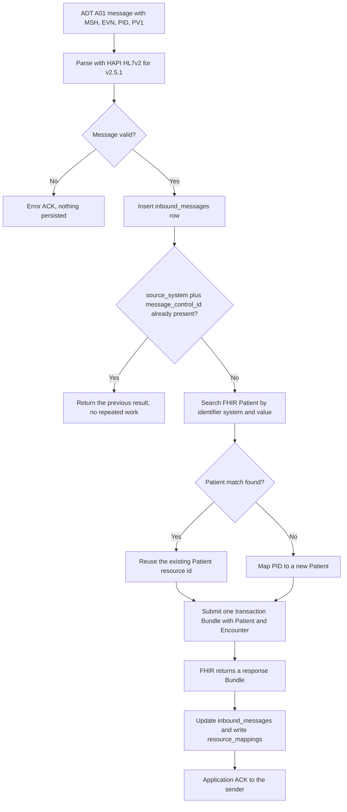

# Sequence diagrams

Two diagrams cover the heart of the integration: the ADT A01 admission flow from init.md section 4 and the HL7-to-FHIR data flow that feeds it. The decision points after each diagram name the rule and the plan that implements it.

## ADT A01 admission

### Decision points

The plan text for this flow is init.md section 4 and plan 02.

- Duplicate detection. The message key is `source_system` plus `message_control_id` (MSH-10), backed by the `uq_source_message` unique constraint. A retransmitted message returns the previous result instead of repeating successful work. If the same visit arrives with a new control id, the encounter is located by its visit identifier rather than created again.
- Identifier search. The FHIR resource id is not the source identifier. PID-3 becomes a search on `Patient?identifier=<system>|<value>`, and the match decides create versus update. For a new resource, the FHIR server assigns the id, and the application never assumes PID-3 equals it. Plan 01 phase 6 and plan 02 implement this.
- Transaction Bundle. Patient and Encounter go to the server as one FHIR transaction Bundle, so the FHIR side is all or nothing. The application database is not part of that transaction, so the two databases can disagree momentarily. State is persisted separately and replays search by identifier, which keeps the workflow safe ([ADR-0004](architecture-decisions/ADR-0004.md)).
- Acknowledgments. HL7 supports original and enhanced acknowledgment modes. An acceptance ACK means the message was received and recorded, not that the FHIR workflow finished. The application ACK reports the processing outcome when the negotiated protocol requires it. Plan 02 implements both modes.
- Encounter identity. The hospital visit identifier is preserved on `Encounter.identifier`, and message timestamps are never treated as admission timestamps. Retransmission therefore cannot create a second Encounter for the same visit.

## HL7 to FHIR data flow

### Field mapping used in this flow

| HL7 element | FHIR element | Notes |
|---|---|---|
| PID-3 | Patient.identifier | System from the assigning authority, value from the identifier value |
| PID-5 | Patient.name | Family and given components |
| PID-7 | Patient.birthDate | |
| PID-8 | Patient.gender | HL7 administrative sex mapped to a FHIR gender code |
| PV1-2 | Encounter.class | Through the documented code table, for example I to inpatient |
| PV1 visit number | Encounter.identifier | The hospital visit identifier is preserved; plan 02 fixes the exact field assumption and records it in its workflow page |

Unmapped HL7 fields are dropped unless a defined business requirement says otherwise, per init.md section 7 of the master prompt. No nonstandard FHIR attributes are invented when a standard element exists.
