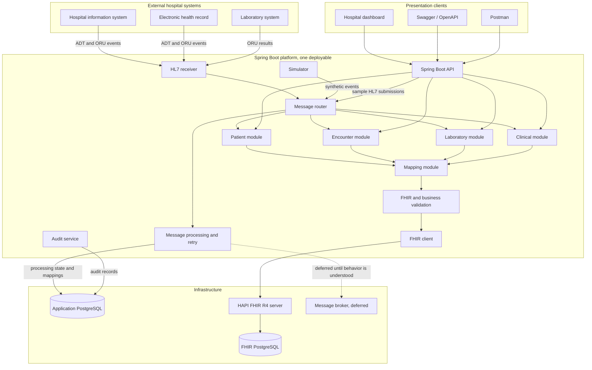

# System overview

The platform is one Spring Boot application that receives hospital events, maps them to FHIR R4 resources, and stores clinical data in a HAPI FHIR server. The application keeps operational state in its own PostgreSQL database and never duplicates the clinical record. This page lists the components from init.md section 1, describes the request and event flows, and shows the runtime shape. The reasoning behind the shape is in the [architecture decision records](architecture-decisions/README.md).

## Components

The table restates the responsibility list from init.md section 1 and adds the plan that builds each component.

| Component | Responsibility | Built by |
|---|---|---|
| Spring Boot API | Exposes application-specific REST endpoints under `/api/v1` | [Plan 1](../../plans/spring-boot/01-foundation.md) phase 6, extended by plans 2 to 4 |
| HL7 receiver | Receives and acknowledges HL7 v2 messages | [Plan 2](../../plans/spring-boot/02-hl7-admissions.md) |
| Message router | Identifies message types and dispatches workflows | Plan 2 |
| Patient module | Patient registration, search, updates, identity | Plan 1 phase 6 |
| Encounter module | Admission, transfer, discharge | Plan 2 |
| Laboratory module | Orders, results, diagnostic reports | [Plan 3](../../plans/spring-boot/03-clinical-labs.md) |
| Clinical module | Allergies, conditions, medications | Plan 3 |
| Mapping module | Converts HL7 data into appropriate FHIR resources | Plans 2 and 3 |
| FHIR client | Communicates with the FHIR server | Plan 1 phase 4 |
| HAPI FHIR server | Stores, validates, and exposes FHIR resources | Plan 1 phase 3 |
| Application database | Stores operational metadata, message status, and audit records | Plan 1 phase 5 |
| Simulator | Generates synthetic hospital events and patient data | [Plan 4](../../plans/spring-boot/04-reliability-ops.md) |

Two support components from the init.md diagram complete the picture. The message processing and retry service owns the persistent state machine and writes processing state to the application database. The audit service records operational audit rows there as well. Both are logical roles inside the single deployable, not separate services.

The optional message broker from init.md is deliberately absent from the initial implementation. [ADR-0005](architecture-decisions/ADR-0005.md) records why processing starts on PostgreSQL.

## Request flow

REST clients call the Spring Boot API. They are the hospital dashboard, the Swagger / OpenAPI view, and Postman during development. The controllers validate request DTOs and delegate to use cases. The use cases call the domain and the ports, and outbound work passes through the mapping module, FHIR and business validation, and the FHIR client. The HAPI FHIR server validates and persists the resources in the FHIR database.

The same API accepts sample HL7 messages at `POST /api/v1/messages/hl7`. Those messages enter the message router through the REST path instead of the MLLP receiver, which makes the pipeline testable without a sending system.

Raw FHIR interactions, such as `GET /fhir/Patient?identifier=...`, go straight to the HAPI FHIR server. The application does not wrap or proxy them. The [API conventions](api-conventions.md) fix that boundary.

## Event flow

The hospital information system, the electronic health record, and the laboratory system send HL7 v2 messages to the HL7 receiver over MLLP. The receiver parses and validates the message, records an `inbound_messages` row, and hands the message to the router. The router identifies the message type and dispatches it to the patient, encounter, laboratory, or clinical module. The module resolves identities, maps HL7 fields through the mapping module, validates the result, and submits it through the FHIR client. The FHIR server persists the resources into the FHIR database. The processing service updates message status and resource mappings in the application database, and the sender receives acknowledgments as the negotiated protocol requires. The [sequence diagrams](sequence-diagrams.md) walk through the admission case.

The simulator generates synthetic hospital events and patient data during development. It feeds the same router and API paths, so seeded data passes through production code paths rather than direct database writes.

## Operational state

Only operational metadata lives in the application database: `inbound_messages` for message control ids, processing status, and errors; `resource_mappings` for source identifier to FHIR resource id mappings; and audit records. The processing status values are RECEIVED, VALIDATED, PROCESSING, RETRY_PENDING, COMPLETED, and QUARANTINED. The [database design](database-design.md) lists the columns and constraints.

## Runtime diagram

## Boundaries

- The HAPI FHIR server is the source of truth for clinical resources, and the application stores no duplicate clinical tables ([ADR-0003](architecture-decisions/ADR-0003.md)).
- Each database has one writer. The application owns its PostgreSQL schema through Flyway, and the HAPI FHIR server owns the FHIR database ([ADR-0004](architecture-decisions/ADR-0004.md)).
- No distributed transaction spans the two databases. Idempotent handlers, the message control id unique constraint, and resource mappings make replay safe, per init.md sections 4 and 6.
- The application is a single deployable. The Maven modules are design boundaries, not services ([ADR-0001](architecture-decisions/ADR-0001.md)).
