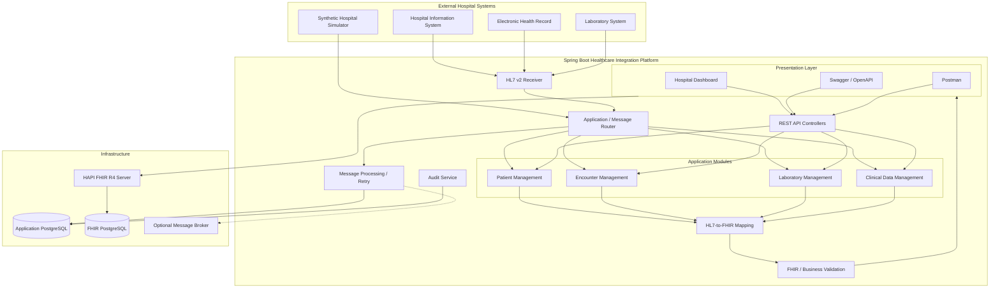
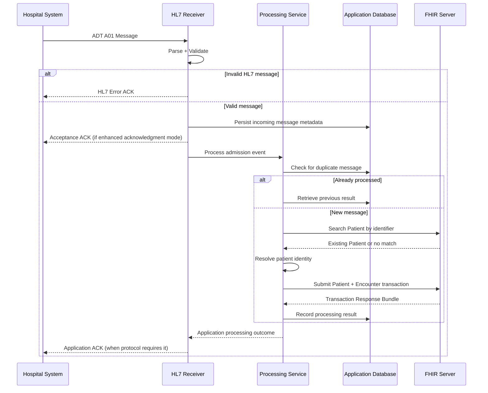

Chatgpt link - https://chatgpt.com/share/6ac7a15d-fa04-83ee-918c-119383caf519

# Spring Boot Healthcare Interoperability Platform
### Complete Architecture, System Design, Project Structure, and AI Coding Agent Prompt

For your upcoming U.S. healthcare project, I recommend building a **Hospital Interoperability Platform** using Java, Spring Boot, HL7 v2, and FHIR R4.

The objective is to understand how a real healthcare integration works, from patient registration and hospital admission to laboratory results, medication orders, and discharge.

Importantly, **don't start with microservices**. Start with a modular monolith for the business logic, connected to a separate FHIR server. You'll learn clean architecture, healthcare standards, and distributed-system integration without introducing unnecessary complexity.

---

## 1. High-level system architecture



### Architectural decisions

| Component | Responsibility |
|---|---|
| Spring Boot API | Exposes application-specific REST endpoints |
| HL7 receiver | Receives and acknowledges HL7 v2 messages |
| Message router | Identifies message types and dispatches workflows |
| Patient module | Patient registration, search, updates, identity |
| Encounter module | Admission, transfer, discharge |
| Laboratory module | Orders, results, diagnostic reports |
| Clinical module | Allergies, conditions, medications |
| Mapping module | Converts HL7 data into appropriate FHIR resources |
| FHIR client | Communicates with the FHIR server |
| HAPI FHIR server | Stores, validates, and exposes FHIR resources |
| Application database | Stores operational metadata, message status, and audit records |
| Simulator | Generates synthetic hospital events and patient data |

**Important:** The FHIR server should be the source of truth for the clinical resources in this learning project. Avoid separately maintaining an entire duplicate clinical database in Spring Boot.

---

## 2. Detailed repository layout

I recommend a **Maven multi-module project**, but with a single deployable Spring Boot integration application initially.

```text
healthcare-interoperability/
│
├── README.md
├── pom.xml
├── docker-compose.yml
├── .env.example
├── .gitignore
│
├── docs/
│   ├── architecture/
│   │   ├── system-overview.md
│   │   ├── component-diagram.md
│   │   ├── sequence-diagrams.md
│   │   ├── database-design.md
│   │   └── architecture-decisions/
│   │
│   ├── hl7/
│   │   ├── hl7-v2-fundamentals.md
│   │   ├── message-types.md
│   │   ├── segment-reference.md
│   │   └── acknowledgments.md
│   │
│   ├── fhir/
│   │   ├── fhir-fundamentals.md
│   │   ├── resource-relationships.md
│   │   ├── terminology.md
│   │   ├── search-and-bundles.md
│   │   └── us-core-overview.md
│   │
│   ├── workflows/
│   │   ├── patient-registration.md
│   │   ├── patient-admission.md
│   │   ├── patient-transfer.md
│   │   ├── patient-discharge.md
│   │   └── laboratory-results.md
│   │
│   └── api/
│       └── openapi.yaml
│
├── healthcare-domain/
│   └── src/main/java/com/example/healthcare/domain/
│       ├── patient/
│       ├── encounter/
│       ├── laboratory/
│       ├── clinical/
│       ├── event/
│       └── exception/
│
├── healthcare-hl7/
│   └── src/main/java/com/example/healthcare/hl7/
│       ├── parser/
│       ├── receiver/
│       ├── router/
│       ├── acknowledgment/
│       ├── validator/
│       └── generator/
│
├── healthcare-fhir/
│   └── src/main/java/com/example/healthcare/fhir/
│       ├── client/
│       ├── config/
│       ├── mapper/
│       ├── terminology/
│       ├── validator/
│       └── transaction/
│
├── healthcare-application/
│   └── src/main/java/com/example/healthcare/
│       ├── HealthcareApplication.java
│       │
│       ├── patient/
│       │   ├── PatientController.java
│       │   ├── PatientService.java
│       │   └── PatientRequest.java
│       │
│       ├── encounter/
│       │   ├── EncounterController.java
│       │   ├── EncounterService.java
│       │   └── EncounterRequest.java
│       │
│       ├── laboratory/
│       │   ├── LaboratoryController.java
│       │   └── LaboratoryService.java
│       │
│       ├── ingestion/
│       │   ├── MessageController.java
│       │   └── MessageProcessingService.java
│       │
│       ├── simulator/
│       │   ├── SyntheticPatientGenerator.java
│       │   ├── HospitalEventSimulator.java
│       │   └── DataSeeder.java
│       │
│       ├── audit/
│       │   ├── AuditService.java
│       │   └── MessageAuditRepository.java
│       │
│       ├── security/
│       └── config/
│
├── healthcare-integration-tests/
│   └── src/test/java/
│       ├── PatientWorkflowIT.java
│       ├── EncounterWorkflowIT.java
│       ├── HL7ProcessingIT.java
│       └── FhirIntegrationIT.java
│
├── infrastructure/
│   ├── postgres/
│   ├── fhir-server/
│   └── observability/
│
├── samples/
│   ├── hl7/
│   │   ├── adt-a01.hl7
│   │   ├── adt-a02.hl7
│   │   ├── adt-a03.hl7
│   │   └── oru-r01.hl7
│   │
│   └── fhir/
│       ├── patient.json
│       ├── encounter.json
│       ├── observation.json
│       └── diagnostic-report.json
│
└── scripts/
    ├── start-local.sh
    ├── seed-data.sh
    └── run-tests.sh
```

### Why this layout?

The most important design principle is **separation of business logic from interoperability technology**.

For example, `EncounterService` should express hospital operations such as admission, transfer, and discharge.

It should not depend directly on the details of HL7 `PV1` fields.

Similarly, the FHIR mapper should translate resource representations without deciding whether a patient should be admitted.

This makes it easier to support both HL7 messages and REST requests without duplicating the core healthcare workflows.

---

## 3. Internal architecture: Hexagonal architecture

Inside your Spring Boot application, follow a simplified hexagonal architecture.

```text
                    INPUT ADAPTERS
                          |
           +--------------+--------------+
           |                             |
     REST Controller                HL7 Receiver
           |                             |
           +--------------+--------------+
                          |
                          v
                   APPLICATION LAYER
                          |
             +------------+------------+
             |                         |
       Patient Use Cases         Encounter Use Cases
             |                         |
             +------------+------------+
                          |
                          v
                      DOMAIN
                          |
                 Business Rules
                          |
                          v
                     PORTS
                          |
             +------------+------------+
             |                         |
        FHIR Port               Message Audit Port
             |                         |
             v                         v
        FHIR Adapter             Database Adapter
             |                         |
             v                         v
        FHIR Server                PostgreSQL
```

An interface such as `PatientRepositoryPort` can abstract how a patient is located and saved.

```java
public interface PatientRepositoryPort {

    Optional<Patient> findByIdentifier(
            String system,
            String value
    );

    Patient save(Patient patient);
}
```

The FHIR adapter implements this contract using the HAPI FHIR client.

For a learning project, you can use FHIR R4 resource models at the boundary while keeping important business rules in your application services.

---

## 4. Patient admission: Detailed sequence

Consider this HL7 admission event:

```text
MSH|^~\&|HOSPITAL|MAIN|INTEGRATION|MAIN|20261008190000||ADT^A01^ADT_A01|MSG001|P|2.5.1
EVN|A01|20261008190000
PID|1||12345^^^HOSPITAL^MR||DOE^JOHN||19900515|M
PV1|1|I|WARD1^ROOM101^BED1
```

The application should perform the following operations:



There are several important considerations.

**Patient matching:** Do not assume `PID-3` equals the FHIR resource ID. Search using the identifier system and value.

**Encounter identity:** Preserve the hospital's visit identifier. Otherwise, retransmitted messages can create duplicate encounters.

**Acknowledgments:** HL7 supports original and enhanced acknowledgment modes. An acceptance acknowledgment does not necessarily mean the complete FHIR workflow has succeeded. Implement the mode negotiated with the sending system.

**Transactions:** Where supported, send related FHIR resources using a transaction Bundle. FHIR transactions provide all-or-nothing behavior for operations inside that transaction, but they do not automatically make your application database and FHIR database one atomic transaction. [HL7](https://hl7.org/fhir/R4/http.html?utm_source=chatgpt.com)

---

## 5. Data ownership and database architecture

Use two logically separate databases.

| Database | Stores | Does not store |
|---|---|---|
| Application PostgreSQL | Message control IDs, processing status, retries, mappings, audit metadata | An unnecessary duplicate of the full clinical record |
| FHIR PostgreSQL | Patient, Encounter, Observation, Condition, DiagnosticReport and other FHIR resources | Your custom HL7 processing queue and application workflow state |

Suggested application tables:

```sql
CREATE TABLE inbound_messages (
    id UUID PRIMARY KEY,
    source_system VARCHAR(100) NOT NULL,
    message_control_id VARCHAR(150) NOT NULL,
    message_type VARCHAR(50) NOT NULL,
    processing_status VARCHAR(30) NOT NULL,
    received_at TIMESTAMPTZ NOT NULL,
    processed_at TIMESTAMPTZ,
    error_code VARCHAR(100),
    error_summary TEXT,

    CONSTRAINT uq_source_message
    UNIQUE (source_system, message_control_id)
);
```

```sql
CREATE TABLE resource_mappings (
    id UUID PRIMARY KEY,
    source_system VARCHAR(100) NOT NULL,
    source_identifier_system VARCHAR(255) NOT NULL,
    source_identifier_value VARCHAR(255) NOT NULL,
    fhir_resource_type VARCHAR(100) NOT NULL,
    fhir_resource_id VARCHAR(150) NOT NULL,

    CONSTRAINT uq_source_resource
    UNIQUE (
        source_system,
        source_identifier_system,
        source_identifier_value,
        fhir_resource_type
    )
);
```

These are simplified schemas. Add migration scripts, indexes, constraints, timestamps, and separate operational audit records as needed.

Avoid logging patient names, diagnoses, raw HL7 payloads, or other protected health information without a deliberate security and retention design.

---

## 6. Error handling and reliability

Healthcare interoperability is not just about creating correct JSON.

Messages can arrive twice, arrive out of sequence, contain missing identifiers, or fail during FHIR persistence.

Your architecture should explicitly handle these situations.

| Problem | Expected behavior |
|---|---|
| Duplicate HL7 message | Return the appropriate ACK without repeating successful work |
| Missing patient identifier | Reject or quarantine according to the interface rules |
| FHIR server unavailable | Retry with backoff |
| Invalid FHIR resource | Record validation errors and stop inappropriate retries |
| Unknown message type | Reject or route to an unsupported-message handler |
| Out-of-order transfer | Detect missing encounter state and reconcile or quarantine |
| Conflicting patient identifiers | Require a defined patient matching policy |
| Partial application failure | Recover using persistent processing state |

For reliability, build a **persistent message-processing state machine**:

```text
RECEIVED
   |
   v
VALIDATED
   |
   v
PROCESSING
   |
   +-------> RETRY_PENDING
   |               |
   |               v
   |           PROCESSING
   |
   +-------> QUARANTINED
   |
   v
COMPLETED
```

A useful distinction is between transient failures and permanent validation errors.

A connection timeout might justify retries. An invalid clinical code or ambiguous patient identity generally requires correction rather than repeated requests.

For an initial implementation, a PostgreSQL-backed processing queue is sufficient. Introduce RabbitMQ or Kafka only after you understand the operational behavior.

---

## 7. API design

Your custom Spring Boot endpoints should support the simulation and business workflows.

| Method | Endpoint | Purpose |
|---|---|---|
| `POST` | `/api/v1/patients` | Register patient |
| `GET` | `/api/v1/patients/{id}` | Retrieve patient |
| `GET` | `/api/v1/patients/{id}/timeline` | View patient journey |
| `POST` | `/api/v1/encounters/admissions` | Admit patient |
| `POST` | `/api/v1/encounters/{id}/transfers` | Transfer patient |
| `POST` | `/api/v1/encounters/{id}/discharge` | Discharge patient |
| `POST` | `/api/v1/laboratory/orders` | Create laboratory order |
| `POST` | `/api/v1/laboratory/results` | Record result |
| `POST` | `/api/v1/messages/hl7` | Submit sample HL7 message |
| `GET` | `/api/v1/messages/{id}` | Inspect processing status |
| `POST` | `/api/v1/simulator/reset` | Reset development fixtures |

Keep the native FHIR APIs separate.

For example:

```http
GET /fhir/Patient?identifier=...
GET /fhir/Encounter?subject=Patient/123
GET /fhir/Observation?patient=123
POST /fhir
```

`POST /fhir` can submit a FHIR transaction Bundle to a server whose FHIR base path is `/fhir`.

FHIR R4 supports RESTful interactions, searches, and transaction processing. [HL7](https://hl7.org/fhir/R4/bundle.html?utm_source=chatgpt.com)

---

## 8. Development dashboard

A lightweight dashboard will make learning substantially easier.

Design these pages:

**Patient Directory:** Search synthetic patients by name or medical record number, and open their profiles.

**Patient Timeline:** Display registration, admissions, transfers, observations, laboratory results, and discharge in chronological order.

**HL7 Message Inspector:** Show incoming HL7 segments, parsed field values, message metadata, acknowledgment, and processing status.

**FHIR Resource Explorer:** Display formatted JSON for Patient, Encounter, Observation, and other linked resources.

**Hospital Simulator:** Trigger admission, transfer, discharge, and laboratory events without manually writing HL7 messages.

**Message Processing Dashboard:** Display completed, failed, retried, and quarantined messages.

A basic React interface is optional. Since Spring Boot is your primary learning goal, you could initially implement the dashboard with Thymeleaf.

---

# 9. Master prompt for your AI coding agents

The following is the expanded prompt I recommend using.

You can paste it directly into Codex or another coding agent.

```text
PROJECT NAME:
Healthcare Interoperability Learning Platform

ROLE:
Act as a principal Java software architect, senior Spring Boot
engineer, and US healthcare interoperability specialist.

You have expertise in:

- Java 21
- Spring Boot
- Hexagonal Architecture
- Domain-Driven Design
- HL7 v2.5.1
- FHIR R4
- HAPI HL7v2
- HAPI FHIR
- PostgreSQL
- Healthcare integration patterns
- REST API design
- Docker
- Automated testing
- Application security
- Distributed-system reliability

============================================================
1. PROJECT OBJECTIVE
============================================================

Build an educational healthcare interoperability platform
that simulates the operations of a US hospital.

The system must demonstrate:

1. Patient registration
2. Patient admission
3. Patient transfer
4. Patient discharge
5. Vital-sign observations
6. Laboratory orders
7. Laboratory results
8. Allergy management
9. Diagnosis management
10. Medication prescriptions
11. HL7 v2 message exchange
12. FHIR resource management
13. Message acknowledgments
14. Healthcare data validation
15. Error recovery
16. Healthcare API integration
17. Basic interoperability security

The objective is to understand complete healthcare workflows,
not merely translate HL7 messages into FHIR JSON.

Use ONLY synthetic patient data.

============================================================
2. TECHNOLOGY STACK
============================================================

Primary language:
Java 21

Framework:
Spring Boot

Build:
Maven multi-module project

HL7:
HAPI HL7v2

FHIR:
HAPI FHIR R4 client and models

FHIR persistence:
Separate HAPI FHIR JPA Server

Database:
PostgreSQL

Testing:
JUnit 5
Mockito
Testcontainers
Spring Boot Test

Documentation:
OpenAPI
Markdown
Mermaid diagrams

Infrastructure:
Docker Compose

Logging:
SLF4J
Structured logging

Monitoring:
Spring Boot Actuator
Micrometer
OpenTelemetry where appropriate

Use supported, mutually compatible dependency versions.

Verify dependencies before implementation.

============================================================
3. ARCHITECTURAL REQUIREMENTS
============================================================

Implement a MODULAR MONOLITH.

Do not introduce microservices initially.

Use Hexagonal Architecture principles.

Clearly separate:

- Presentation layer
- Application layer
- Domain layer
- Infrastructure layer
- Interoperability adapters

Use constructor-based dependency injection.

Do not put business logic in controllers.

Do not put business logic inside HL7 parsers.

Do not put business decisions inside FHIR mappers.

Define clear interfaces between modules.

Avoid circular dependencies.

Avoid unnecessary generic abstractions.

Use straightforward Java code.

The system should have these Maven modules:

1. healthcare-domain
2. healthcare-hl7
3. healthcare-fhir
4. healthcare-application
5. healthcare-integration-tests

The application module is the primary Spring Boot executable.

The FHIR server runs separately.

============================================================
4. DOMAIN DESIGN
============================================================

Implement these business capabilities:

PATIENT MANAGEMENT

- Register patient
- Update demographics
- Search patients
- Match patient identifiers
- Prevent duplicate registration

ENCOUNTER MANAGEMENT

- Admit patient
- Transfer patient
- Discharge patient
- Manage encounter identifiers
- Maintain encounter location history

LABORATORY MANAGEMENT

- Place laboratory orders
- Record laboratory results
- Generate diagnostic reports
- Link observations to patients and encounters

CLINICAL MANAGEMENT

- Record allergies
- Record diagnoses
- Record medication prescriptions

MESSAGE MANAGEMENT

- Receive HL7 messages
- Parse HL7 messages
- Route messages by type
- Validate messages
- Track message processing
- Produce acknowledgments
- Handle duplicate messages
- Retry transient failures

Keep domain rules independent of transport formats.

============================================================
5. HL7 V2 PROCESSING
============================================================

Support HL7 v2.5.1 initially.

Start with the following messages:

ADT A04
ADT A01
ADT A02
ADT A03
ADT A08
ORU R01

Add other message types only when justified.

Implement:

- HL7 message parser
- Message-type router
- Segment extraction
- Field validation
- Message control ID tracking
- Acknowledgment generation
- Error handling
- Duplicate detection

Use HAPI HL7v2.

For each message type:

1. Explain the event.
2. Document the required segments.
3. Show an example message.
4. Extract the relevant fields.
5. Explain the mapping.
6. Demonstrate the resulting FHIR resources.
7. Test the acknowledgment behavior.

Do not assume all HL7 versions have identical structures.

Document interface-specific mapping assumptions.

============================================================
6. FHIR RESOURCE MANAGEMENT
============================================================

Use FHIR R4 initially.

Implement these resources:

Patient
Encounter
Location
Observation
DiagnosticReport
ServiceRequest
AllergyIntolerance
Condition
MedicationRequest
Practitioner

Support:

- Resource creation
- Resource retrieval
- Resource updates
- Searching
- Pagination
- Resource references
- Conditional operations
- Transaction Bundles
- Validation
- Error handling

Use actual FHIR resource models.

Do not invent nonstandard attributes when standard
elements are available.

Use extensions only where appropriate.

Maintain clear separation between resource IDs
and business identifiers.

============================================================
7. HL7-TO-FHIR MAPPING
============================================================

Create dedicated mapper classes.

Examples:

PatientHl7Mapper
EncounterHl7Mapper
ObservationHl7Mapper
DiagnosticReportHl7Mapper

Document important source mappings.

Examples:

PID-3 -> Patient.identifier
PID-5 -> Patient.name
PID-7 -> Patient.birthDate
PID-8 -> Patient.gender

PV1-2 -> Encounter.class

Map additional fields according to the interface
specification and FHIR R4 requirements.

Do not assume message timestamps represent
admission timestamps.

Use visit identifiers when matching encounters.

Provide unit tests for every mapper.

Preserve unmapped information only when a defined
business requirement exists.

============================================================
8. DATABASE DESIGN
============================================================

Maintain separate persistence responsibilities.

APPLICATION DATABASE:

Store:

- HL7 message metadata
- Processing state
- Retry attempts
- External identifiers
- FHIR resource mappings
- Operational audit records
- Simulator metadata

FHIR DATABASE:

Store FHIR resources through the HAPI FHIR server.

Do not modify HAPI FHIR internal tables directly.

Use Flyway or Liquibase for application database
schema migrations.

Design appropriate uniqueness constraints
and indexes.

Avoid duplicate clinical storage.

============================================================
9. MESSAGE PROCESSING AND RELIABILITY
============================================================

Implement these states:

RECEIVED
VALIDATED
PROCESSING
RETRY_PENDING
COMPLETED
QUARANTINED

Support:

- Idempotent processing
- Duplicate message detection
- Retry with exponential backoff
- Maximum retry limits
- Poison message handling
- Validation failures
- FHIR server downtime
- Request timeouts
- Processing audit trails

Explain HL7 original and enhanced acknowledgment modes.

Do not acknowledge application success before
successful processing when the selected acknowledgment
protocol requires it.

Avoid treating database and FHIR server operations
as a single distributed transaction.

Document recovery and reconciliation strategies.

Initially use PostgreSQL-backed message processing.

Do not add Kafka or RabbitMQ during the first
implementation phase.

============================================================
10. SYNTHETIC DATA GENERATION
============================================================

Implement a development-only startup data seeder.

Generate:

- 20 synthetic patients
- 10 inpatient encounters
- 10 outpatient encounters
- Multiple hospital locations
- 5 synthetic practitioners
- Vital-sign observations
- Laboratory reports
- Allergies
- Diagnoses
- Medication prescriptions

Use deterministic fixtures where practical.

The seeder must be idempotent.

Application restarts must not create duplicates.

The seeder must be disabled by default
outside development environments.

Never generate actual patient records.

============================================================
11. API DESIGN
============================================================

Build REST endpoints for:

Patient registration
Patient search
Patient details
Patient timeline
Patient admission
Patient transfer
Patient discharge
Laboratory orders
Laboratory results
HL7 message submission
HL7 processing status
Synthetic hospital events

Use:

- Request DTOs
- Response DTOs
- Bean Validation
- Global exception handling
- Consistent error responses
- HTTP status codes
- API versioning

Document all endpoints using OpenAPI.

Keep custom application APIs separate from
the standard FHIR server APIs.

============================================================
12. DEVELOPMENT DASHBOARD
============================================================

Build a minimal dashboard.

Pages:

Patient Directory
Patient Profile
Patient Timeline
Encounter Management
HL7 Message Inspector
FHIR Resource Explorer
Laboratory Results
Message Processing Dashboard
Hospital Event Simulator

Prefer Thymeleaf initially.

Do not introduce a complex frontend framework
unless the backend workflows are complete.

Display synthetic data only.

============================================================
13. SECURITY
============================================================

Implement development-safe security controls.

Explain:

- Authentication
- Authorization
- OAuth 2.0
- SMART on FHIR
- Role-based permissions
- HIPAA fundamentals
- Audit logging
- Sensitive-data redaction

Secure application and FHIR endpoints.

Use externalized credentials.

Never commit secrets.

Do not log sensitive clinical payloads by default.

Document production requirements separately
from educational development configuration.

============================================================
14. OBSERVABILITY
============================================================

Use Spring Boot Actuator.

Track:

- Incoming HL7 message counts
- Successful message processing
- Failed message processing
- Retry counts
- FHIR API latency
- FHIR API failures
- Patient creation counts
- Encounter creation counts

Add correlation identifiers.

Use structured application logging.

Optionally integrate OpenTelemetry.

Expose health checks for:

- Application
- PostgreSQL
- FHIR server connectivity

============================================================
15. TESTING STRATEGY
============================================================

Write:

Unit tests
Mapper tests
Controller tests
Service tests
Database integration tests
FHIR integration tests
End-to-end workflow tests

Test scenarios:

1. Patient registration succeeds.
2. Duplicate registration is prevented.
3. Valid ADT A01 creates an encounter.
4. Duplicate ADT A01 does not create another encounter.
5. ADT A02 updates encounter location.
6. ADT A03 completes an encounter.
7. Laboratory results reference the right patient.
8. Invalid HL7 messages are rejected appropriately.
9. FHIR validation errors are handled.
10. FHIR downtime triggers controlled retries.
11. Application restart does not duplicate seeded data.
12. Reprocessing an already completed message is safe.

Use Testcontainers where appropriate.

Tests must be deterministic and repeatable.

============================================================
16. DOCUMENTATION
============================================================

Generate:

README.md
Architecture overview
Component diagram
Sequence diagrams
Database ER diagram
FHIR resource relationship diagram
HL7 mapping documentation
API documentation
Deployment guide
Testing guide
Troubleshooting guide

Use Mermaid for diagrams.

For every scenario explain:

- Business purpose
- Healthcare workflow
- Incoming HL7 message
- FHIR resources involved
- Expected HTTP operations
- Expected acknowledgment
- Database impact
- Error conditions
- Acceptance criteria

============================================================
17. IMPLEMENTATION PHASES
============================================================

PHASE 1:
Architecture documentation and project skeleton.

PHASE 2:
Docker Compose, PostgreSQL, HAPI FHIR Server.

PHASE 3:
FHIR Patient CRUD and patient search.

PHASE 4:
HL7 parsing and acknowledgment generation.

PHASE 5:
HL7 ADT A04 patient registration.

PHASE 6:
HL7 ADT A01 patient admission.

PHASE 7:
HL7 ADT A02 transfer.

PHASE 8:
HL7 ADT A03 discharge.

PHASE 9:
Observations and laboratory results.

PHASE 10:
Allergies, diagnoses, and medications.

PHASE 11:
Reliability, retry handling, and auditing.

PHASE 12:
Synthetic data simulator.

PHASE 13:
Dashboard.

PHASE 14:
Security and observability.

PHASE 15:
Comprehensive integration testing and documentation.

============================================================
18. CODING AGENT OPERATING RULES
============================================================

Implement one phase at a time.

Before modifying code:

1. Inspect the existing repository.
2. Identify relevant modules.
3. Explain intended changes.
4. List acceptance criteria.
5. Verify library compatibility.

During implementation:

1. Follow the established architecture.
2. Avoid unnecessary dependencies.
3. Keep business logic testable.
4. Use standard healthcare terminology.
5. Write maintainable Java code.
6. Include tests alongside implementation.
7. Do not invent HL7 or FHIR requirements.

After implementation:

1. Compile the project.
2. Run relevant tests.
3. Report test results.
4. Provide sample requests and responses.
5. Document architectural decisions.
6. Identify limitations.
7. Explain the next logical phase.

Never claim tests passed unless they were executed.

Do not silently change architecture.

Do not implement all phases at once.

============================================================
19. INITIAL TASK
============================================================

Begin with PHASE 1.

Produce:

1. Architecture overview
2. Complete Maven multi-module structure
3. Module dependency diagram
4. Hexagonal architecture design
5. Main component responsibilities
6. Database ownership design
7. Proposed API conventions
8. HL7-to-FHIR data flow
9. Testing strategy
10. Architecture Decision Records

After completing the architecture and project skeleton,
implement the smallest working vertical slice:

Spring Boot application
    ->
HAPI FHIR client
    ->
Local HAPI FHIR server
    ->
Create synthetic Patient
    ->
Read Patient through FHIR API

Include automated verification.

Keep the platform simple enough for one developer
to understand, run, and extend.
```

---

## 10. How I'd use coding agents for this project

Rather than asking multiple agents to modify the entire repository independently, divide responsibilities.

| Agent | Ownership | Expected output |
|---|---|---|
| Architecture Agent | Architecture, interfaces, ADRs, documentation | Module design and architectural decisions |
| Spring Boot Agent | Controllers, use cases, application services | REST endpoints and business workflows |
| HL7 Agent | Parsing, routing, acknowledgments | HL7 integration module |
| FHIR Agent | Resource mappings, validation, API integration | FHIR adapters and mappings |
| QA Agent | Unit, integration, end-to-end testing | Test suite and coverage evidence |

Assign one agent responsibility for integrating changes and enforcing architectural consistency.

For example, the HL7 Agent should not independently alter FHIR persistence rules, and the FHIR Agent should not redefine admission business logic.

This gives you the benefits of parallel development without ending up with five different architectural approaches.

---

## 11. Development milestones

I would measure progress using working demonstrations rather than just completed classes.

| Milestone | Demonstration |
|---|---|
| M1 | Start Spring Boot, PostgreSQL, and HAPI FHIR locally |
| M2 | Register and retrieve a synthetic patient through FHIR |
| M3 | Submit an HL7 A04 message and observe patient creation |
| M4 | Submit an HL7 A01 message and observe encounter creation |
| M5 | Transfer and discharge the same patient encounter |
| M6 | Record vital signs and laboratory results |
| M7 | Restart and replay messages without duplicate records |
| M8 | Inspect the full patient journey using the dashboard |
| M9 | Demonstrate authentication, validation, and auditing |

### Recommended starting point

**Build Milestones 1 through 5 before introducing laboratory integrations, message brokers, or advanced frontend components.**

Those milestones will teach you the central concepts:

- How HL7 messages represent hospital events.
- How FHIR resources represent healthcare information.
- How Spring Boot orchestrates healthcare workflows.
- How patient identifiers and encounter relationships work.
- How to handle repeated or incorrect messages safely.

For reference, HAPI HL7v2 provides Java-based HL7 parsing and encoding, while FHIR R4 defines the REST interactions and resource model needed for the other side of the integration. [HAPI FHIR](https://hapifhir.github.io/hapi-hl7v2/?utm_source=chatgpt.com)

**The architecture I'd choose for your learning repository is a Maven multi-module Spring Boot modular monolith, a separate HAPI FHIR server, PostgreSQL for operational state, and a deterministic hospital simulator.** That is complex enough to teach real healthcare interoperability while remaining manageable for an individual developer.